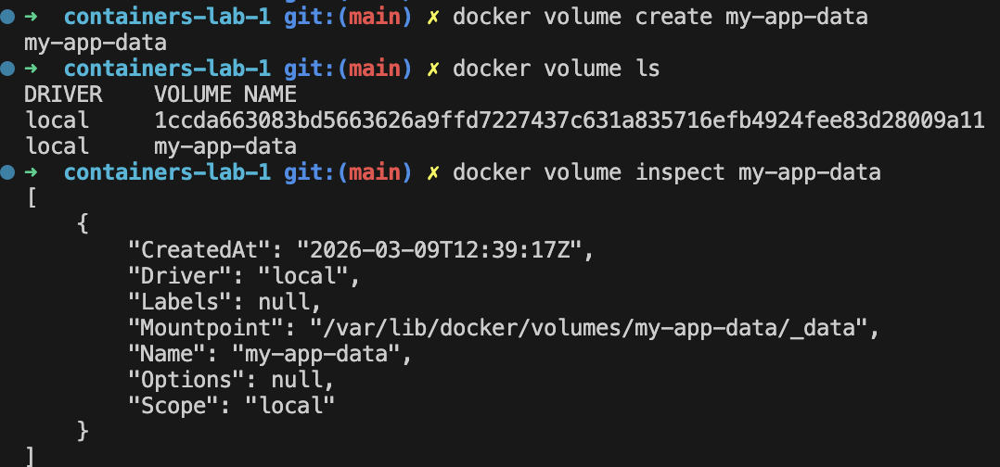
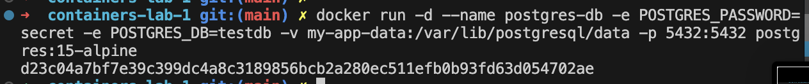
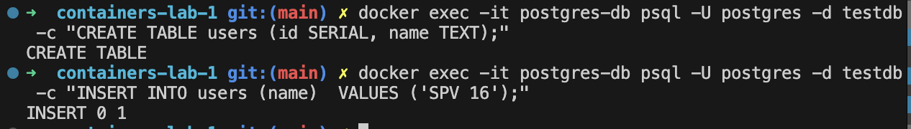
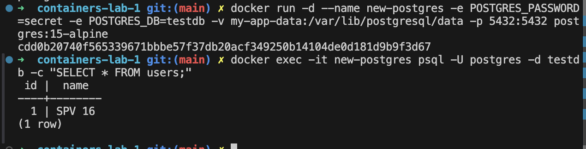
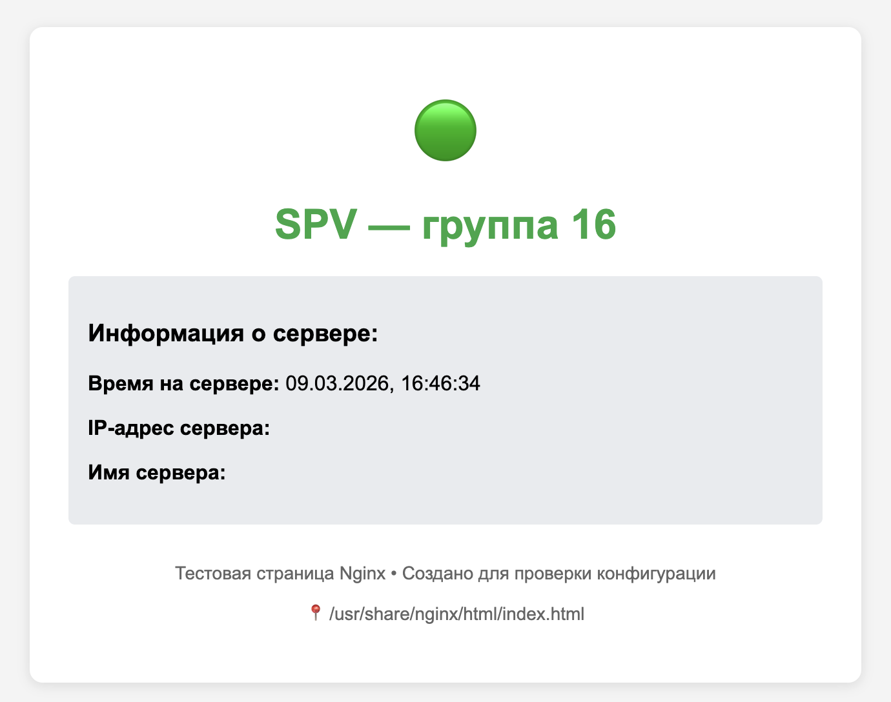
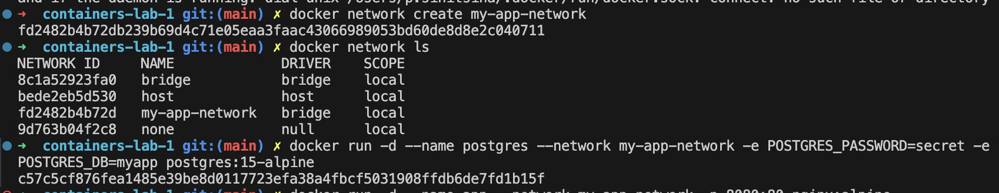
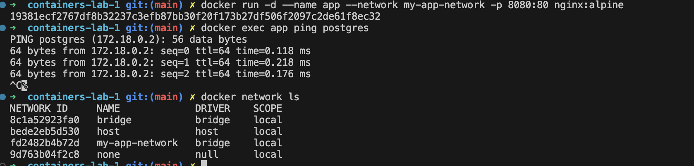

# Отчет по практической работе №1
## Студент: СПВ
## Группа: 16
## Дата выполнения: 01.03.2026

### Работа с образами

#### Поиск образов в Docker Hub
```
docker search nginx
NAME                                     DESCRIPTION                                     STARS     OFFICIAL

nginx                                    Official build of Nginx.                        21204     [OK]

nginx/nginx-ingress                      NGINX and  NGINX Plus Ingress Controllers fo…   115    

nginx/nginx-prometheus-exporter          NGINX Prometheus Exporter for NGINX and NGIN…   50     

nginx/unit                               This repository is retired, use the Docker o…   66     

nginx/nginx-ingress-operator             NGINX Ingress Operator for NGINX and NGINX P…   3      

nginx/nginx-quic-qns                     NGINX QUIC interop                              1     

nginx/nginxaas-loadbalancer-kubernetes                                                   1     

nginx/unit-preview                       Unit preview features                           0      

bitnami/nginx                            Bitnami Secure Image for nginx                  203   

bitnamicharts/nginx                      Bitnami Helm chart for NGINX Open Source        3     

ubuntu/nginx                             Nginx, a high-performance reverse proxy & we…   140  

kasmweb/nginx                            An Nginx image based off nginx:alpine and in…   8     

rancher/nginx                                                                            3    

linuxserver/nginx                        An Nginx container, brought to you by LinuxS…   236    

dtagdevsec/nginx                         T-Pot Nginx                                     0     

paketobuildpacks/nginx                                                                   0     

vmware/nginx                                                                             3    

chainguard/nginx                         Build, ship and run secure software with Cha…   5    

gluufederation/nginx                      A customized NGINX image containing a consu…   1   
     
cleanstart/nginx                         Secure by Design, Built for Speed, Hardened …   0   

antrea/nginx                             Nginx server used for Antrea e2e testing        0   

intel/nginx                                                                              0  

circleci/nginx                           This image is for internal use                  2  

activestate/nginx                        ActiveState's customizable, low-to-no vulner…   0  

docksal/nginx                            Nginx service image for Docksal                 1  
```

#### Скачивание образа
```
docker pull nginx:alpine

alpine: Pulling from library/nginx

da8475fa07c7: Pull complete 

9084d2ffc283: Pull complete 

88799a707571: Pull complete 

d8ad8cd72600: Pull complete 

7833e4e4252c: Pull complete 

c5ad07fbd6e6: Pull complete 

821790ca706f: Pull complete 

31d394b0c9ed: Pull complete 

9bbe0d69ab20: Download complete 

978fc7908a0b: Download complete 

Digest: sha256:1d13701a5f9f3fb01aaa88cef2344d65b6b5bf6b7d9fa4cf0dca557a8d7702ba

Status: Downloaded newer image for nginx:alpine

docker.io/library/nginx:alpine
```

#### Просмотр локальных образов

```
docker images
                                               i Info →   U  In Use

IMAGE          ID             DISK USAGE   CONTENT SIZE   EXTRA

nginx:alpine   1d13701a5f9f       92.6MB         26.7MB    

```

#### Просмотр истории слоев образа

```
 docker history nginx:alpine

IMAGE          CREATED       CREATED BY                                      SIZE      COMMENT

1d13701a5f9f   4 weeks ago   RUN /bin/sh -c set -x     && apkArch="$(cat …   50.7MB    buildkit.dockerfile.v0

<missing>      4 weeks ago   ENV ACME_VERSION=0.3.1                          0B        buildkit.dockerfile.v0

<missing>      4 weeks ago   ENV NJS_RELEASE=1                               0B        buildkit.dockerfile.v0

<missing>      4 weeks ago   ENV NJS_VERSION=0.9.5                           0B        buildkit.dockerfile.v0

<missing>      4 weeks ago   CMD ["nginx" "-g" "daemon off;"]                0B        buildkit.dockerfile.v0

<missing>      4 weeks ago   STOPSIGNAL SIGQUIT                              0B        buildkit.dockerfile.v0

<missing>      4 weeks ago   EXPOSE map[80/tcp:{}]                           0B        buildkit.dockerfile.v0

<missing>      4 weeks ago   ENTRYPOINT ["/docker-entrypoint.sh"]            0B        buildkit.dockerfile.v0

<missing>      4 weeks ago   COPY 30-tune-worker-processes.sh /docker-ent…   16.4kB    buildkit.dockerfile.v0

<missing>      4 weeks ago   COPY 20-envsubst-on-templates.sh /docker-ent…   12.3kB    buildkit.dockerfile.v0

<missing>      4 weeks ago   COPY 15-local-resolvers.envsh /docker-entryp…   12.3kB    buildkit.dockerfile.v0

<missing>      4 weeks ago   COPY 10-listen-on-ipv6-by-default.sh /docker…   12.3kB    buildkit.dockerfile.v0

<missing>      4 weeks ago   COPY docker-entrypoint.sh / # buildkit          8.19kB    buildkit.dockerfile.v0

<missing>      4 weeks ago   RUN /bin/sh -c set -x     && addgroup -g 101…   5.82MB    buildkit.dockerfile.v0

<missing>      4 weeks ago   ENV DYNPKG_RELEASE=1                            0B        buildkit.dockerfile.v0

<missing>      4 weeks ago   ENV PKG_RELEASE=1                               0B        buildkit.dockerfile.v0

<missing>      4 weeks ago   ENV NGINX_VERSION=1.29.5                        0B        buildkit.dockerfile.v0

<missing>      4 weeks ago   LABEL maintainer=NGINX Docker Maintainers <d…   0B        buildkit.dockerfile.v0

<missing>      5 weeks ago   CMD ["/bin/sh"]                                 0B        buildkit.dockerfile.v0

<missing>      5 weeks ago   ADD alpine-minirootfs-3.23.3-aarch64.tar.gz …   9.36MB    buildkit.dockerfile.v0

```

#### Удаление образа
```
docker rmi nginx:alpine 

Untagged: nginx:alpine

Deleted: sha256:1d13701a5f9f3fb01aaa88cef2344d65b6b5bf6b7d9fa4cf0dca557a8d7702ba
```


#### Скачивание образа PostgreSQL версии 15
```
docker pull postgres:15-alpine

15-alpine: Pulling from library/postgres

40f8c3d5a1d5: Pull complete 
5d06985dfd8f: Pull complete 
c087e1d68052: Pull complete 
6beba71c3b17: Pull complete 
64537e9fb506: Pull complete 
ad5ecb3a5168: Pull complete 
1e908ba1c422: Pull complete 
a760e82798cc: Pull complete 
4b92316cf9d3: Pull complete 
459953e5a03c: Pull complete 
1d47b544ff70: Download complete 
3dc302c15f92: Download complete 
Digest: sha256:fceb6f86328c36f2438fae3b851b0cc57c4a7e69a58c866d9ce24281f2cf0c9c
Status: Downloaded newer image for postgres:15-alpine
docker.io/library/postgres:15-alpine
```

#### Скачивание образа golang версии 1.21

```
docker pull golang:1.21-alpine

1.21-alpine: Pulling from library/golang

4f4fb700ef54: Pull complete 
171883aaf475: Pull complete 
2a6022646f09: Pull complete 
690e87867337: Pull complete 
e495e1face5c: Pull complete 
5b876a0e8ec3: Download complete 
b6a4ffdacca7: Download complete 
Digest: sha256:2414035b086e3c42b99654c8b26e6f5b1b1598080d65fd03c7f499552ff4dc94
Status: Downloaded newer image for golang:1.21-alpine
docker.io/library/golang:1.21-alpine
```

#### Просмотр образов 
```
docker images

                              i Info →   U  In Use

IMAGE                ID             DISK USAGE

golang:1.21-alpine   2414035b086e        334MB

nginx:alpine         1d13701a5f9f       92.6MB

postgres:15-alpine   fceb6f86328c        386MB


`docker run -it --name test-alpine alpine:latest sh`


docker run -it --name test-alpine alpine:latest sh

Unable to find image 'alpine:latest' locally

latest: Pulling from library/alpine

37093440b0e0: Download complete 

cb94f19e6ea6: Download complete 

Digest: sha256:25109184c71bdad752c8312a8623239686a9a2071e8825f20acb8f2198c3f659


Status: Downloaded newer image for alpine:latest

/ # ls
bin    home   mnt    root   srv    usr
dev    lib    opt    run    sys    var
etc    media  proc   sbin   tmp


docker run --name postgres15 \
  -e POSTGRES_PASSWORD=postgres \
  -d postgres:15-alpine
b3bec486ed63719afabc74853e472b989e1a6839bb098329ef53283359a9cc82

 docker exec -it postgres15 sh
```
#### Работа с томами (Volumes)





  


####  Сеть в Docker

Задание 2.4.1: Создайте изолированную сеть для взаимодействия контейнеров

  
  