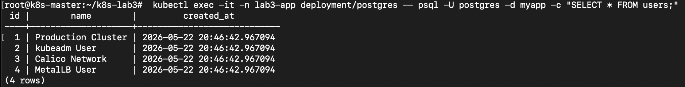
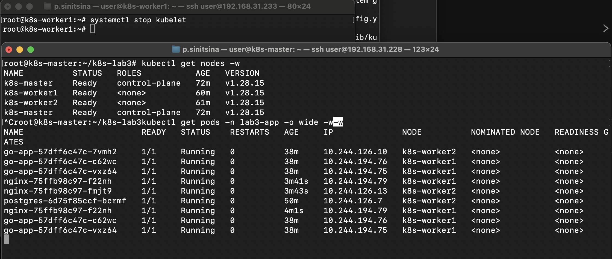
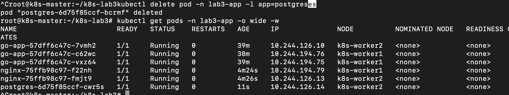
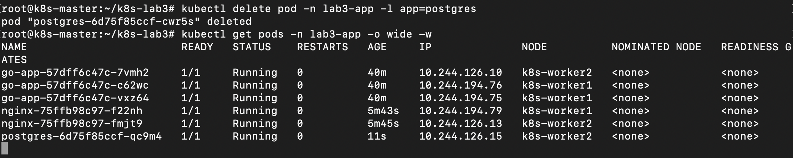

# Отчет по практической работе №1
## Студент: СПВ
## Группа: 16
## Дата выполнения: 01.04.2026

### 1. Подготовка узлов
#### 1.1 Версия ОС и настройки
```
root@k8s-master:~/k8s-lab3# cat /etc/os-release
PRETTY_NAME="Debian GNU/Linux 12 (bookworm)"
NAME="Debian GNU/Linux"
VERSION_ID="12"
VERSION="12 (bookworm)"
VERSION_CODENAME=bookworm
ID=debian
HOME_URL="https://www.debian.org/"
SUPPORT_URL="https://www.debian.org/support"
BUG_REPORT_URL="https://bugs.debian.org/"
```
#### 1.2 Отключение swap
```
root@k8s-master:~/k8s-lab3# free -m
               total        used        free      shared  buff/cache   available
Mem:            3919        1715         165           3        2204        2204
Swap:              0           0           0
```
#### 1.3 Модули ядра 
```
root@k8s-master:~/k8s-lab3# lsmod | grep -E "overlay|br_netfilter"
br_netfilter           32768  0
bridge                262144  1 br_netfilter
overlay               135168  29
```
### 2. Установка containerd
#### 2.1 Версия containerd
```
root@k8s-master:~/k8s-lab3# containerd --version
containerd containerd.io v2.2.2 301b2dac98f15c27117da5c8af12118a041a31d9
```
#### 2.2 Конфигурация containerd
```
root@k8s-master:~/k8s-lab3# cat /etc/containerd/config.toml | grep SystemdCgroup
            SystemdCgroup = true
```            

### 3. Установка kubeadm
#### 3.1 Версии компонентов
```
root@k8s-master:~/k8s-lab3# kubeadm version
kubeadm version: &version.Info{Major:"1", Minor:"28", GitVersion:"v1.28.15", GitCommit:"841856557ef0f6a399096c42635d114d6f2cf7f4", GitTreeState:"clean", BuildDate:"2024-10-22T20:33:16Z", GoVersion:"go1.22.8", Compiler:"gc", Platform:"linux/arm64"}
```
### 4. Инициализация кластера
#### 4.1 Узлы кластера
```
root@k8s-master:~/k8s-lab3# kubectl get nodes -o wide
NAME          STATUS     ROLES           AGE   VERSION    INTERNAL-IP   EXTERNAL-IP   OS-IMAGE                         KERNEL-VERSION   CONTAINER-RUNTIME
k8s-master    Ready      control-plane   83m   v1.28.15   10.0.0.1      <none>        Debian GNU/Linux 12 (bookworm)   6.1.0-44-arm64   containerd://2.2.2
k8s-worker1   NotReady   <none>          70m   v1.28.15   10.0.0.2      <none>        Debian GNU/Linux 12 (bookworm)   6.1.0-44-arm64   containerd://2.2.2
k8s-worker2   Ready      <none>          71m   v1.28.15   10.0.0.3      <none>        Debian GNU/Linux 12 (bookworm)   6.1.0-44-arm64   containerd://2.2.2
```
#### 4.2 Поды в namespace kube-system
```
root@k8s-master:~/k8s-lab3# kubectl get pods -n kube-system
NAME                                 READY   STATUS    RESTARTS   AGE
coredns-5dd5756b68-2gq6t             1/1     Running   0          82m
coredns-5dd5756b68-p5rck             1/1     Running   0          82m
etcd-k8s-master                      1/1     Running   0          83m
kube-apiserver-k8s-master            1/1     Running   0          83m
kube-controller-manager-k8s-master   1/1     Running   0          83m
kube-proxy-8k52q                     1/1     Running   0          70m
kube-proxy-k68h6                     1/1     Running   0          82m
kube-proxy-vskc2                     1/1     Running   0          71m
kube-scheduler-k8s-master            1/1     Running   0          83m
```
### 5. Сетевые компоненты
#### 5.1 Calico
```
user@k8s-master:~$ kubectl get pods -n kube-system | grep calico
calico-kube-controllers-787f445f84-g8q22   1/1     Running    0             2m48s
calico-node-7qw6m                          1/1     Running    0             97s
calico-node-f4bnm                          1/1     Running    0             2m48s
calico-node-ng7cs                          0/1     Init:2/3   0             37s
```
#### 5.2 MetalLB
```
root@k8s-master:~/k8s-lab3# kubectl get pods -n metallb-system
NAME                          READY   STATUS    RESTARTS   AGE
controller-5c6b6c8447-ccjxp   1/1     Running   0          4m12s
speaker-5lksj                 1/1     Running   0          66m
speaker-82kqh                 1/1     Running   0          66m
speaker-c8ztm                 1/1     Running   0          66m
```
#### 5.3 Ingress Controller
```
root@k8s-master:~/k8s-lab3# kubectl get pods -n ingress-nginx
NAME                                        READY   STATUS      RESTARTS   AGE
ingress-nginx-admission-patch-ttkfc         0/1     Completed   2          66m
ingress-nginx-controller-6dc9c5fb7c-tqcc5   1/1     Running     0          66m
```
### 6. Развернутое приложение
#### 6.1 Все ресурсы в namespace lab3-app
```
root@k8s-master:~/k8s-lab3# kubectl get all -n lab3-app
NAME                            READY   STATUS        RESTARTS   AGE
pod/go-app-57dff6c47c-7vmh2     1/1     Running       0          47m
pod/go-app-57dff6c47c-c62wc     1/1     Terminating   0          47m
pod/go-app-57dff6c47c-fzjgb     1/1     Running       0          3m36s
pod/go-app-57dff6c47c-qhdmk     1/1     Running       0          3m36s
pod/go-app-57dff6c47c-vxz64     1/1     Terminating   0          47m
pod/nginx-75ffb98c97-f22nh      1/1     Terminating   0          12m
pod/nginx-75ffb98c97-fmjt9      1/1     Running       0          12m
pod/nginx-75ffb98c97-x669k      1/1     Running       0          3m36s
pod/postgres-6d75f85ccf-qc9m4   1/1     Running       0          7m10s

NAME               TYPE        CLUSTER-IP       EXTERNAL-IP   PORT(S)    AGE
service/go-app     ClusterIP   10.110.205.78    <none>        8080/TCP   59m
service/nginx      ClusterIP   10.110.225.157   <none>        80/TCP     39m
service/postgres   ClusterIP   10.99.187.147    <none>        5432/TCP   59m

NAME                       READY   UP-TO-DATE   AVAILABLE   AGE
deployment.apps/go-app     3/3     3            3           59m
deployment.apps/nginx      2/2     2            2           59m
deployment.apps/postgres   1/1     1            1           59m

NAME                                  DESIRED   CURRENT   READY   AGE
replicaset.apps/go-app-5686ddbdfc     0         0         0       56m
replicaset.apps/go-app-568b5859bb     0         0         0       48m
replicaset.apps/go-app-57dff6c47c     3         3         3       47m
replicaset.apps/go-app-6b88cd4db9     0         0         0       59m
replicaset.apps/go-app-c5bf6749f      0         0         0       56m
replicaset.apps/nginx-674646f887      0         0         0       27m
replicaset.apps/nginx-75ffb98c97      2         2         2       12m
replicaset.apps/nginx-785546bf7d      0         0         0       21m
replicaset.apps/nginx-7fdcf7c4f8      0         0         0       59m
replicaset.apps/postgres-6d75f85ccf   1         1         1       59m

```

#### 6.2 PersistentVolumeClaim
```
root@k8s-master:~/k8s-lab3# kubectl get pvc -n lab3-app
NAME           STATUS   VOLUME                                     CAPACITY   ACCESS MODES   STORAGECLASS   AGE
postgres-pvc   Bound    pvc-4bcbd4d7-0971-4fa9-acac-2e5040dba54b   5Gi        RWO            local-path     34h
```
### 7. Скриншоты
#### 7.1 Главная страница приложения


#### 7.2 Список пользователей из БД


### 8. Тестирование отказоустойчивости
#### 8.1 Симуляция отказа узла




#### 8.2 Проверка сохранности данных





### 9. Ответы на контрольные вопросы
1. **Какие компоненты входят в control plane и какова их роль?**
   - **kube-apiserver** — центральная точка входа в кластер (REST API), аутентификация/авторизация, валидация объектов, запись/чтение состояния.
   - **etcd** — распределённое key-value хранилище, где хранится «истина» о состоянии кластера (все объекты и конфигурация).
   - **kube-scheduler** — назначает Pod’ы на узлы, выбирая подходящий Node по ресурсам/ограничениям/политикам.
   - **kube-controller-manager** — набор контроллеров, которые приводят фактическое состояние к желаемому (Deployment/ReplicaSet, Node controller и т.д.).
   - Дополнительно в кластере работают **kubelet** (агент на каждом узле, запускает контейнеры через runtime) и **kube-proxy** (правила сетевого доступа к Service), но они относятся к node-компонентам, не к control plane.

2. **Чем отличается развертывание с kubeadm от использования Minikube?**
   - **kubeadm** — инструмент для установки «настоящего» Kubernetes на выделенных узлах (как в работе: отдельный control plane `k8s-master` и worker’ы), с максимальной близостью к production: реальные сети/узлы, отдельный container runtime (`containerd`), полноценные аддоны (Calico/MetalLB/Ingress).
   - **Minikube** — локальный «учебный»/dev-кластер обычно на одной машине (VM/контейнер/драйвер), проще в запуске и обслуживании, но часто имеет упрощения и отличается от «боевого» окружения по сети, балансировке и инфраструктуре.

3. **Для чего нужен CNI-плагин и какую роль выполняет Calico?**
   - **CNI (Container Network Interface)** отвечает за создание сетевого подключения Pod’ов: назначение IP, настройку маршрутизации/туннелей, чтобы Pod’ы могли общаться между узлами, а также за базовую интеграцию сети с Kubernetes.
   - **Calico** в этом кластере обеспечивает pod-to-pod связность между нодами и поддержку **NetworkPolicy** (сетевые политики). В отчёте видно, что Calico развёрнут в `calico-system` и обеспечивает работоспособную межнодовую сеть для приложения.

4. **В чем разница между Service типа NodePort, LoadBalancer и Ingress?**
   - **NodePort**: открывает порт на *каждом* узле и проксирует трафик на Service (доступ вида `NodeIP:NodePort`). В отчёте Ingress Controller также имеет Service типа NodePort.
   - **LoadBalancer**: предоставляет внешний IP и балансирует трафик на Service. В «голом металле» внешний IP обычно выдаёт **MetalLB**. В работе это видно на примере `ingress-nginx-controller-lb`, который получил внешний адрес `10.0.0.100`.
   - **Ingress**: HTTP/HTTPS-маршрутизация на уровне L7 (хосты/пути), которая направляет запросы на разные Service внутри кластера. В манифестах `k8s/3/05-ingress.yaml` настроены правила для домена `lab3.k8s.local`: `/` → Service `nginx`, `/api` → Service `go-app`.

5. **Как обеспечивается отказоустойчивость control plane?**
   - Отказоустойчивость control plane достигается **масштабированием control plane** (несколько control-plane узлов) и **кластером etcd** (обычно 3 или 5 участников) + балансировщиком перед `kube-apiserver`.
   - В текущей лабораторной сборке control plane представлен одним узлом (`k8s-master`), поэтому это **не HA-конфигурация**: при отказе master’а управление кластером станет недоступно, хотя workload на worker’ах может продолжать работать до деградации.
### 10. Выводы
В ходе работы был собран Kubernetes-кластер на Debian 12 с помощью kubeadm (control plane + два worker’а), настроен container runtime `containerd`, подключены сетевые компоненты Calico (CNI), MetalLB (выдача внешних IP для Service типа LoadBalancer) и NGINX Ingress Controller (маршрутизация HTTP по хосту/пути).

Основные сложности были связаны с подготовкой узлов (отключение swap, загрузка модулей ядра `overlay`/`br_netfilter`, корректная настройка `containerd` с `SystemdCgroup=true`), а также с пониманием сетевой части: как CNI обеспечивает связность Pod’ов, как MetalLB раздаёт адреса из пула, и как Ingress правилами связывает домен и пути с Service’ами приложения.

Практика помогла лучше понять принцип «желаемого состояния» в Kubernetes: Deployment поддерживает нужное число реплик (в работе `go-app` — 3, `nginx` — 2), при проблемах с узлом Pod’ы пересоздаются на доступных нодах, а данные PostgreSQL сохраняются благодаря PVC (после пересоздания Pod’а данные из БД остались доступными, что подтверждено запросом `SELECT * FROM users;`). В результате стало яснее, как взаимодействуют control plane, CNI и сервисные абстракции (Service/Ingress) при построении отказоустойчивого приложения.